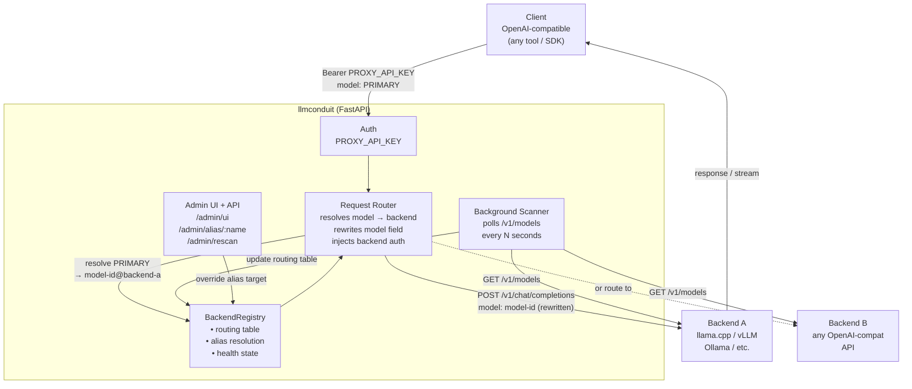

# llmconduit

Multi-backend OpenAI-compatible aggregating reverse proxy. Run multiple LLM inference servers and expose them all through a single endpoint with unified auth, stable role aliases, and automatic model discovery.

## How it works



**Request flow:**
1. Client authenticates with `PROXY_API_KEY` and sends `model: "model-id@backend-name"` or a role alias (`PRIMARY`, `AUXILIARY`, …)
2. llmconduit resolves the alias → qualified model, strips the `@backend-name` suffix, rewrites the request body, injects backend auth if configured, and forwards the request
3. Streaming and non-streaming responses are passed through transparently
4. If a model isn't in the routing table, llmconduit rescans that backend before returning 404

## Features

- **Single endpoint** — one URL, one API key for all downstream clients
- **Role aliases** — stable names (`PRIMARY`, `CODING`, …) that you retarget at runtime without touching any client config
- **Auto-discovery** — polls each backend's `/v1/models` on a configurable interval
- **Miss-triggered rescan** — on a routing miss, rescans the target backend before failing
- **Per-backend auth** — forward caller auth, strip it, or inject a backend-specific key
- **Admin UI** — browser-based alias switcher at `/admin/ui?token=<ADMIN_TOKEN>`
- **Admin API** — programmatic alias overrides, rescan, reload via `/admin/*` endpoints
- **Streaming** — full SSE / chunked-transfer passthrough
- **Docker-native** — single container, config mounted as a volume

## Quickstart

```bash
# 1. REQUIRED — copy the template and set your secrets before anything else
cp .env.template .env
#   open .env and set PROXY_API_KEY to any strong secret string
#   optionally set ADMIN_TOKEN to enable the /admin/* endpoints

# 2. edit config.yaml — uncomment and fill in your backends and aliases

# 3. bring it up
docker compose up -d
```

> **Note:** The container will refuse to start if `PROXY_API_KEY` is not set in `.env`.

The proxy listens on port `8000` by default (`PROXY_PORT` to override).

## Configuration

### `config.yaml`

```yaml
backends:
  - url: http://my-llama-server:8080
    # no api_key — caller's Authorization header forwarded as-is

  - url: http://another-server:11434
    api_key: ANOTHER_SERVER_KEY   # env var name; value set in .env

aliases:
  PRIMARY: llama3.1-8b@my-llama-server
  CODING:  deepseek-coder@another-server
```

- **Backend name** is derived from the hostname automatically
- **Models** are exposed as `model-id@backend-name`
- **Aliases** are case-insensitive; a role only appears in `/v1/models` while its target backend is healthy
- Change `config.yaml` and call `POST /admin/reload` (or `docker compose restart`) to apply

### Environment variables

All variables are set in `.env` (copy from `.env.template`).

| Variable | Required | Default | Description |
|---|---|---|---|
| `PROXY_API_KEY` | **Yes** | — | Shared key all clients use to authenticate |
| `ADMIN_TOKEN` | No | — | Enables `/admin/*` endpoints; omit to disable |
| `CONFIG_PATH` | No | `/etc/llmconduit/config.yaml` | Path to config file (override for local runs) |
| `REFRESH_INTERVAL_SECONDS` | No | `60` | How often to poll backends for model lists |
| `MISS_RETRY_ATTEMPTS` | No | `3` | Rescans before returning 404 on a routing miss |
| `MISS_RETRY_DELAY_SECONDS` | No | `2` | Delay between miss retry rescans |
| `BACKEND_SCAN_TIMEOUT` | No | `10` | Timeout for `/v1/models` scan requests |
| `REQUEST_TIMEOUT` | No | `600` | Timeout for proxied inference requests |
| `REQUEST_CONNECT_TIMEOUT` | No | `10` | Connection establishment timeout |
| `LOG_LEVEL` | No | `info` | `debug`, `info`, `warning`, `error` |
| `PROXY_PORT` | No | `8000` | Port the proxy listens on |

Per-backend API keys are also set in `.env` and referenced by name in `config.yaml`:
```
EXTERNAL_API_KEY=sk-...
```

## API

All inference endpoints require `Authorization: Bearer <PROXY_API_KEY>`.

### Inference

| Method | Path | Description |
|---|---|---|
| `GET` | `/v1/models` | List all available models and aliases |
| `POST` | `/v1/chat/completions` | Chat completions (streaming supported) |
| `POST` | `/v1/completions` | Text completions |
| `POST` | `/v1/embeddings` | Embeddings |
| `*` | `/{path}` | Catch-all: routes to first healthy backend |

### Health

```
GET /health
```
Unauthenticated. Returns backend counts and model count.

### Admin (requires `ADMIN_TOKEN`)

| Method | Path | Description |
|---|---|---|
| `GET` | `/admin/status` | Full routing table and backend health |
| `POST` | `/admin/rescan` | Rescan all backends |
| `POST` | `/admin/rescan/{backend}` | Rescan one backend |
| `POST` | `/admin/reload` | Re-read `config.yaml` + rescan all |
| `GET` | `/admin/aliases` | List current alias state |
| `POST` | `/admin/alias/{name}` | Override alias target: `{"target": "model@backend"}` |
| `DELETE` | `/admin/alias/{name}` | Clear override (revert to config default) |
| `GET` | `/admin/ui` | Browser-based alias switcher (`?token=<ADMIN_TOKEN>`) |

## Docker

`config.yaml` is bind-mounted read-only into the container at `/etc/llmconduit/config.yaml`.

By default, `docker-compose.yml` uses Docker's default bridge network. llmconduit reaches backends by IP or by hostname if they're on the same compose network.

### Connecting to backends on an external Docker network

If your LLM backends live in a separate compose stack on a named network, attach llmconduit to it with an override file:

```yaml
# docker-compose.override.yml
services:
  llmconduit:
    networks:
      - ai-network

networks:
  ai-network:
    external: true
```

Docker Compose merges this with `docker-compose.yml` automatically on `docker compose up`. You can name the network whatever matches your existing stack.

### Running without Docker

```bash
pip install -r app/requirements.txt
CONFIG_PATH=./config.yaml PROXY_API_KEY=your-key uvicorn app.main:app --host 0.0.0.0 --port 8000
```

## License

Apache 2.0 — see [LICENSE](LICENSE).
